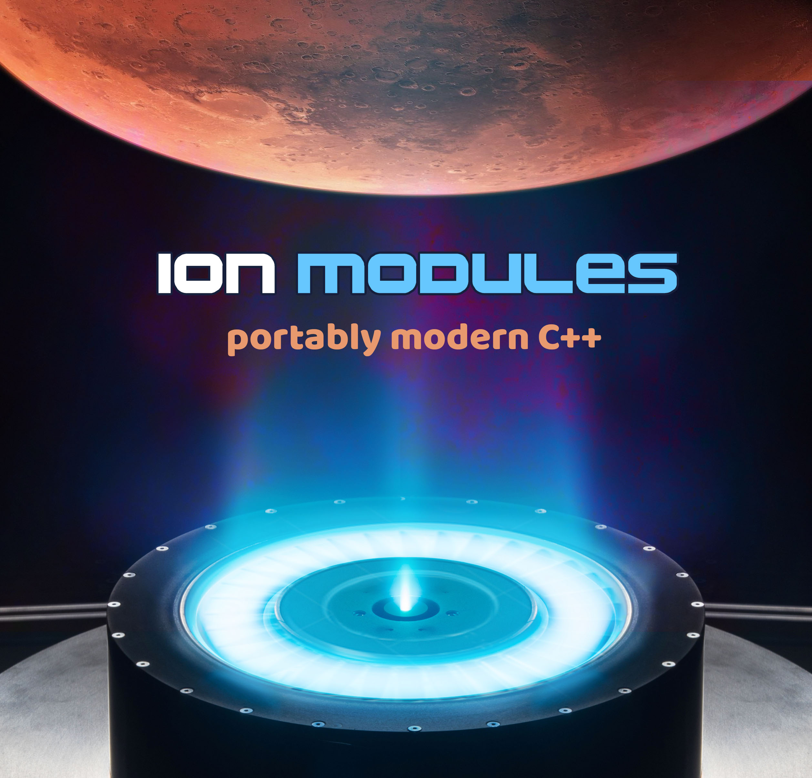

## ion-modules README
> :warning: **Work is on-going at the moment, not all targets are buildable with Vulkan core getting a bit of development**: Still getting some external repos online as well..

Welcome. This repository is host to ion-modules, a project aimed at being a lean and build-for-everywhere software framework written in C++17.  Simply clone, and make an app at the same directory space as ion-modules.  A package.json and 4 line CMake boilerplate is all you need from there:
#### package.json
```json
{
    "name":     "your-app",
    "version":  "0.22.0"
}
```
#### CMakeLists.txt
```cmake
cmake_minimum_required(VERSION 3.3)
include(../ion-modules/cmake/main.cmake)
read_package("package.json" name u v s)
project(${name})
main()
```
... **And you're off..**  Well you still need to make a module folder, so do that and make some translation unit in the module folder you made.  At the moment there has to be 'something' here to build. **app** translation units go into apps and **test** go in tests folders.\
Create an empty mod file and tell it what it depends on.\
The syntax is simple CMake with some really easy-to-use helper additions implicitly available for call.
#### module/mod
```cmake
dep(dx matrix media tensorflow:tensorflowlite==dev)

if(NOT WIN32)
    dep(pthread)
endif()
```
Notice there is a unified dependency syntax here which cascade rules down from module-source, to pkg-config/non-pkg-config libraries, macOS .frameworks, lib, repo:module, repo:module==V\
When we build TensorFlow, we have it in the same peer-repo space as our lib.  That repo has in it a products folder hierarchy of versioned headers, libs and bins for different targets. While it's preferred to 'own' the library you depend on in our opinion its not always easy to do or preferred so you can still use any dependency on the system. The syntax is there to deliver a standard order and clean up what is thought as the ugliest part of software development, the make files.  It turns out using CMake is far and away the cleanest and furthest reaching if you accept some boilerplate. Once your makefiles are using a cascading, modular approach with built in implicit rules it's simply easier to manage them.

You may remove dependencies with dep(-name)\
Standard-Order (syntax shown):
```
dep(module)              # build from source
dep(peer-repo:module)    # build from source, given a peer repo
dep(peer-repo:module==V) # try to grab a product set with this V
dep(pkg-config)          # can be something found by pkg-config
dep(framework.framework) # can be a .framework
dep(lib)                 # ordinary lib
```
Each module folder has a base set of translation units and headers in its folder, with app targets built from apps and tests built from tests.\
Tests require exit code 0 on every app target in order to pass a 'package' target.
#### Progress... 22%
C++20 module conversion likely to start taking place as soon as Vulkan code is established [long and enduring process so far].  Where we are to shine is in general UX facilities, providing next gen composition facilities for a variety of domains. The framework is driving to be a major, sensible alternative to popular offerings. Work is ongoing to establish a Vulkan core for UX, and after that the tests will build.  As for now we're deep in the trenches of Vulkan abstraction.  The ion engine is _slow_ to get going, but will soon build great momentum. 🚀
#### Working HTTPS secure client example
The following shows some Future-based Web::json query in action:
```c++
#include <web/web.hpp>

/// grab a json resource into var form
/// set cwd to res so the web module sees the https trust certs
int main(int argc, const char *argv[]) {
    Args defs = {{ "url", "https://ar-visions.github.io/test-resource.json" }};
    Args args = var::args(argc, argv, defs, "url");
    ///
    Web::json(args["url"]).then([&](Web::Message msg) {
        if (msg.content["wonderful"])
            console.log("expected result");
        ///
    }).except([&](var &err) {
        console.log("request failure: {0}", {err});
    });
    return Async::await();
}
```
> :warning: **Important to run this binary with the cwd set to the resource 'res' dir in web which has the HTTPS trust cert for the domain you are querying in the example.**

\

